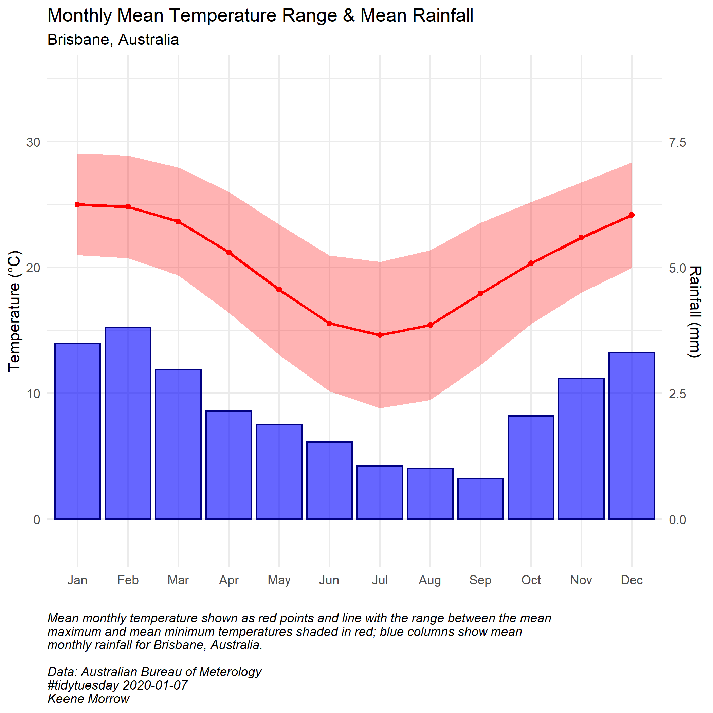

```{r setup, include=FALSE}
knitr::opts_chunk$set(echo = TRUE,
                      warning = FALSE,
                      message = FALSE)
```

### Introduction

At the end of 2019 and beginning of 2020, Australia experienced devastating bushfires. More than 11 million hectares burned, principally in the southeast provinces of New South Wales and Victoria.  Only thirty-three people lost their lives, but more than a billion animals are estimated to have been killed, including on Kangaroo Island, a haven for biological diversity.

The current government of Australia shies away from connecting the intensity of the bushfires to climate change or acknowledging the intense impacts of climate change on the country.  CLimate scientists, on the othe rhand, agree that the extremely high temperatures and severe drought that fueled the bushfires are undoubtably linked to climate change. (BBC)
 
In light of the devastation of these fires, the R For Data Science #tidytuesday prompt for 01-07-2020 included data on the fires and the climate of Australia.  Here, temperature and rainfall data are used to construct climatology graphs for five Australian cities: Brisbane, Canberra, Melbourne, Perth, and Sydney.
 
### Set Up

```{r}
library(tidyverse)
library(lubridate)
library(here)
```


### Read Data
```{r}
rainfall <- readr::read_csv('https://raw.githubusercontent.com/rfordatascience/tidytuesday/master/data/2020/2020-01-07/rainfall.csv')

temperature <- readr::read_csv('https://raw.githubusercontent.com/rfordatascience/tidytuesday/master/data/2020/2020-01-07/temperature.csv')
```


### Wrangling

#### Rainfall
```{r}
rain_date <- rainfall %>%
  mutate(date_new = lubridate::ymd(paste(year, month, day, sep = "-"))) %>% # concatenate dates and make them Date type
  mutate(month = as.numeric(month)) %>% # prep months for applying names
  mutate(month_name = month.abb[month]) %>%  # apply names to months
  mutate(month_name = fct_relevel(month_name, levels = month.abb)) # relevel to get month names in order
```

#### Temperature
```{r}
temp <- temperature %>%
  mutate(city_name = str_to_title(city_name)) %>% #clean up city names (BRISBANE to Brisbane)
  mutate(month = lubridate::month(date)) %>% # pull month from date
  mutate(month_name = month.abb[month]) %>%  # apply names to months
  mutate(month_name = fct_relevel(month_name, levels = month.abb)) %>%  # relevel month names
  mutate(year = lubridate::year(date))
```

### Prep Data for Constructing Climatologies
```{r}
temp_summary <-  temp %>%
  drop_na() %>% # this probably isn't a good idea, but let's assume that the loss of data is evenly distributed throughout the time range and doesn't impact the mean monthly temperature
  group_by(city_name, month_name, temp_type) %>%
  summarize(mean_temp = mean(temperature)) %>%
  pivot_wider(names_from = temp_type, values_from = mean_temp, names_prefix = "mean_temp_")

rain_summary <- rain_date %>%
  mutate(rain_0 = ifelse(is.na(rainfall), 0, rainfall)) %>% # another questionable assumption
  group_by(city_name, month_name) %>%
  summarize(mean_rainfall = mean(rain_0))

climate_mean <- merge(temp_summary, rain_summary)

cities <- unique(climate_mean$city_name) # gets list of the common cities from the merge
```


### Plotting Climatologies

```{r}

# Plot one climatology per city with both temperature and rainfall data (missing some sloppily removed before)

for(i in seq_along(cities)){
  # plot data for each city common between the temperature and rainfall data
  ggplot(data = subset(climate_mean, climate_mean$city_name == cities[i])) +
    # red ribbon for area between mean max temp and mean min temp
    geom_ribbon(aes(x = month_name,
                    ymax = mean_temp_max,
                    ymin = mean_temp_min,
                    group = 1),
                fill = "red", alpha = 0.3) +
    # blue columns for rainfall
    geom_col(aes(x = month_name,
                 y = mean_rainfall*4),
             color = "navy", fill = "blue", alpha = 0.6) +
    # red line and points for mean temperature as mean of mean max and min temp
    geom_line(aes(x = month_name,
                  y = ((mean_temp_max + mean_temp_min)/2),
                  group = 1),
              color = "red",
              size = 1) +
    geom_point(aes(x = month_name,
                   y = ((mean_temp_max + mean_temp_min)/2)),
               color = "red") +
    # scale wrangling
    scale_y_continuous(limits = c(-2, 35), # keeps scales consistent across plots, >-2 will cut off Canberra ribbon
                       sec.axis = sec_axis(~./4, name = "Rainfall (mm)")) + # adds second axis for rainfall, adjusted to counteract the scale factor above
    scale_color_manual(values = c("blue", "red")) +
    labs(y = "Temperature (°C)",
         x = "",
         title = "Monthly Mean Temperature Range & Mean Rainfall",
         # subtitle of plot based on city in question
         subtitle = paste(cities[i],", Australia", sep = ""),
         # include reference to city in question in caption
         caption = paste("Mean monthly temperature shown as red points and line with the range between the mean\nmaximum and mean minimum temperatures shaded in red; blue columns show mean\nmonthly rainfall for ", cities[i], ", Australia.\n\nData: Australian Bureau of Meterology\n#tidytuesday 2020-01-07\nKeene Morrow",
                         sep = "")) +
    theme_minimal() +
    theme(plot.caption = element_text(hjust = 0, face = "italic"))
  
  # save plot with city in question in the file name
  ggsave(here::here("figures", paste(cities[i], "_climate.png", sep = "")),
         height = 7, width = 7)
}
```





### Summary

1. Wrangled dates with `lubridate`.
2. Made some questionable assumptions about NA's in the data.
3. Used `for` loop to generate five plots of climatologies, one for each of the cities with data for both temperature and rainfall.

***

### References

"Australia Fires." #tidytuesday, R for Data Science. https://github.com/rfordatascience/tidytuesday/tree/master/data/2020/2020-01-07

"Australia fires: A visual guide to the bushfire crisis." British Broadcasting Company. 01-31-2020. https://www.bbc.com/news/world-australia-50951043

"Climate Data Online." Australian Bureau of Meterology. http://www.bom.gov.au/climate/data/

Gill, Victoria. "Australia fires were far worse than any prediction." British Broadcasting Company. 02-24-2020. https://www.bbc.com/news/science-environment-51590080?intlink_from_url=https://www.bbc.com/news/topics/c2wlvy54gd1t/australia-fires&link_location=live-reporting-story